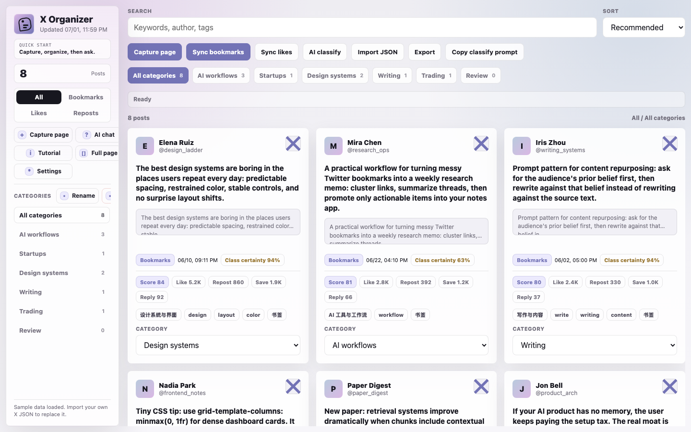
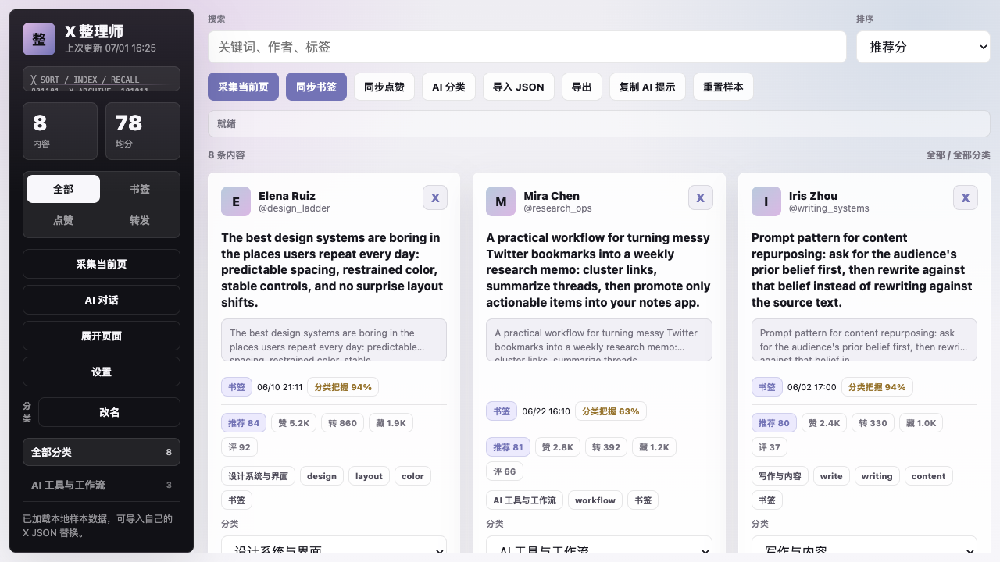
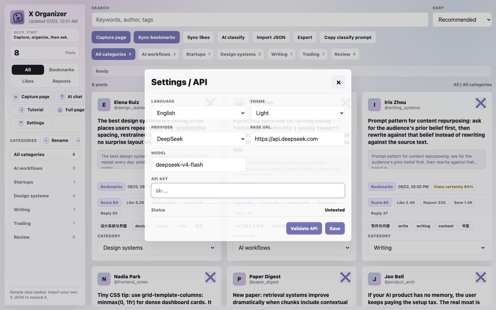
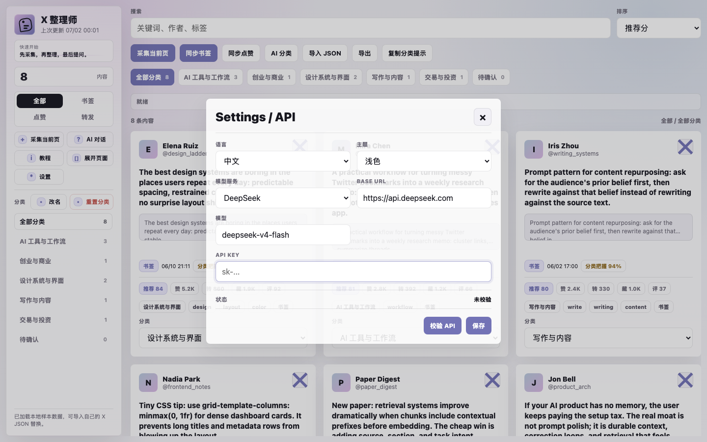
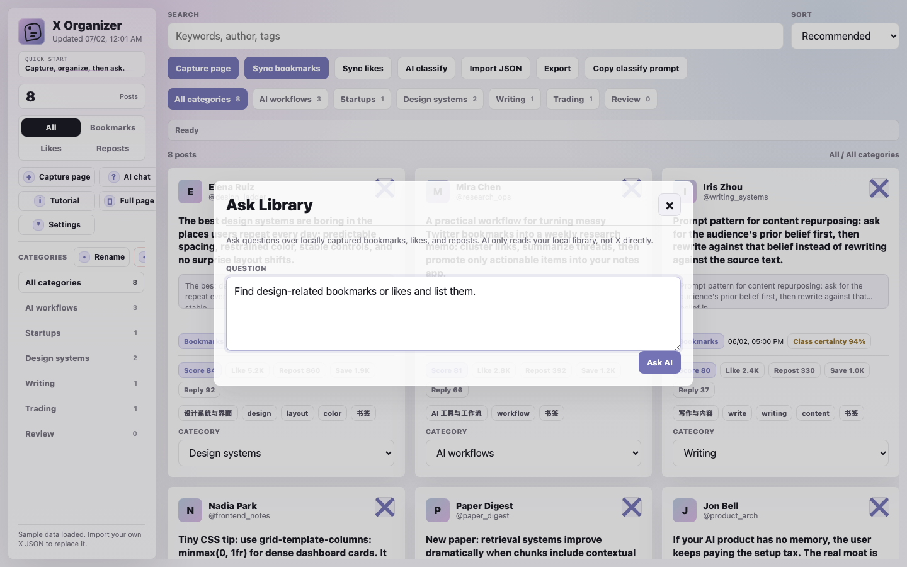
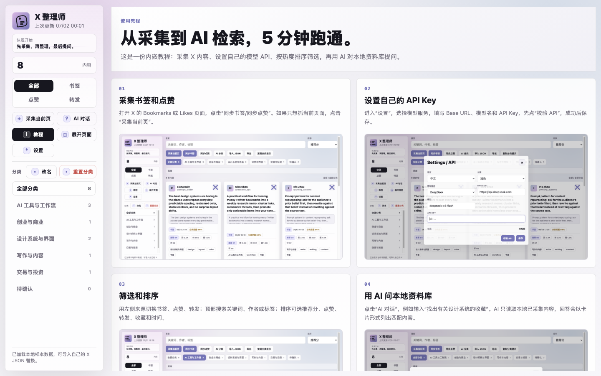
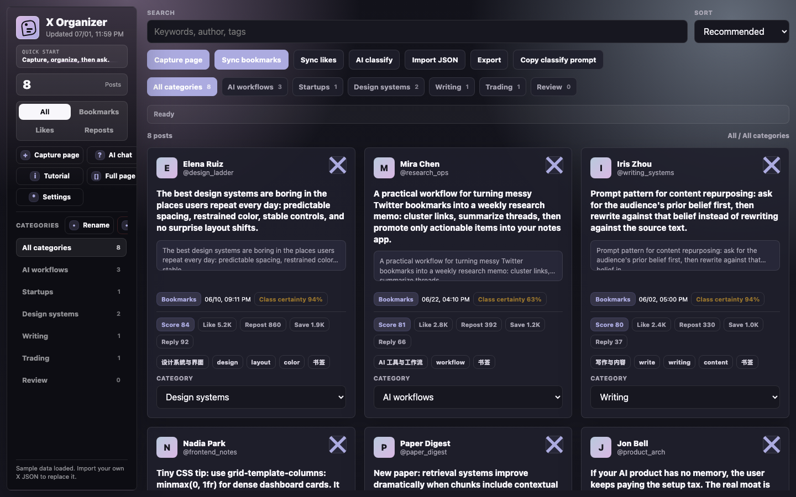

# X Organizer

Local-first Chrome extension for turning your X/Twitter bookmarks, likes, reposts, and visible posts into a searchable, categorized, AI-queryable library.

[中文说明](./README.zh-CN.md)



## Why

X bookmarks are easy to save and hard to reuse. X Organizer keeps the first version local-first: it reads posts that are already visible in your browser, stores them in `chrome.storage.local`, organizes them into cards and categories, and lets you connect your own OpenAI-compatible model API when you want AI classification or Q&A.

No official X API is required for the MVP.

## Features

- **Side panel inside X/Twitter**: injects an `X Organizer` entry into `x.com` / `twitter.com`.
- **Local-first library**: stores captured posts, categories, settings, and sync state in browser local storage.
- **Manual capture**: capture posts currently loaded on the active X/Twitter page.
- **Auto-scroll sync**: sync Bookmarks and Likes by opening/scrolling the X page and collecting rendered posts.
- **Card grid**: review posts as compact cards with author, excerpt, source, metrics, tags, and category.
- **Filtering and sorting**: filter by source/category/search; sort by recommended score, likes, reposts, saves, replies, views, posted time, or saved time.
- **AI categorization**: use your own model API to regenerate categories and item labels.
- **Ask Library**: ask questions over locally collected posts; answers return matching cards.
- **Bring your own API key**: supports DeepSeek, OpenAI, OpenRouter, Moonshot/Kimi, Qwen/DashScope, SiliconFlow, AIMLAPI, and custom OpenAI-compatible providers.
- **Bilingual UI**: English and Chinese.
- **Dark and light themes**.
- **JSON import/export**: export your local library without exporting your API key.

## Screenshots

| English | Chinese |
| --- | --- |
|  |  |
|  |  |
|  |  |

Dark mode:



## Install for local development

1. Clone or download this repository.
2. Open Chrome and go to `chrome://extensions`.
3. Enable **Developer mode**.
4. Click **Load unpacked**.
5. Select the repository folder that contains `manifest.json`.
6. Open `https://x.com` or `https://twitter.com`.
7. Click the `X Organizer` entry in the X sidebar or the extension action to open the side panel.

## How to use

### Capture current page

Open any X/Twitter page with posts loaded, then click **Capture page**. The extension reads the currently rendered posts and merges them into your local library.

### Sync bookmarks or likes

Open X/Twitter, then click **Sync bookmarks** or **Sync likes**. The extension navigates/scrolls the relevant page and captures posts as X renders them.

This is intentionally not a full X API crawler. Coverage depends on what X loads in your browser session.

### Configure your model API

Open **Settings**:

1. Choose a provider.
2. Fill in Base URL, model name, and API key.
3. Click **Validate API**.
4. Save the settings.

API keys stay in `chrome.storage.local` and are not included in JSON exports.

### Ask your library

Click **AI chat**, then ask questions like:

```text
Find design-related bookmarks or likes and list them.
```

The AI only receives posts already saved in your local library.

## Development

```bash
npm install
npm run check
```

Available scripts:

- `npm run validate`: validates extension structure and required files.
- `npm test`: runs Node test files under `tests/`.
- `npm run check`: runs validation and tests.
- `npm run dev:web`: runs the marketing website in `website/`.
- `npm run build:web`: builds the marketing website to `website-dist/`.

## Project structure

```text
manifest.json              Chrome Manifest V3 config
background.js              service worker, side panel open handling, capture/sync messages
content/                   X/Twitter content script and injected UI
sidepanel/                 side panel HTML/CSS/JS
src/domain.js              normalization, dedupe, categorization, filters, scores
src/providers.js           provider presets and API config validation
src/aiClient.js            OpenAI-compatible API validation/classification/Q&A
src/i18n.js                English and Chinese copy
src/storage.js             chrome.storage.local + local preview fallback
data/sample-posts.js       sample posts for local preview
docs/                      technical notes, screenshots, privacy notes
website/                   React + WebGL marketing website
tests/                     Node tests
```

## Privacy and security

- Local post data is stored in `chrome.storage.local`.
- API keys are stored locally and never exported in JSON.
- AI classification and AI chat send selected local post content to the provider you configure.
- The extension does not call the official X API in the MVP.
- The extension does not include any built-in API key.

Read more in [Privacy](./docs/privacy.md).

## Current limitations

- This is an MVP and relies on visible DOM capture instead of official X API access.
- Bookmarks/Likes sync coverage depends on how far X loads while scrolling.
- X DOM changes may break capture selectors.
- Large libraries may eventually need IndexedDB instead of `chrome.storage.local`.

## Release checklist

Before publishing or sharing a build, run:

```bash
npm run check
rg -n "sk-[A-Za-z0-9_-]+|api[-_ ]?key|Bearer " .
```

See [Release checklist](./docs/release-checklist.md) for the full checklist.
