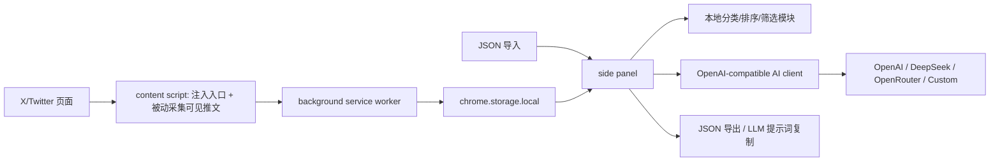

# X Organizer / X 整理师技术方案 v0.3

## 产品目标

把 X/Twitter 上分散的书签、点赞、转发内容，整理成一个本地优先的个人资料库。MVP 先验证信息架构、卡片 UI、数据结构、分类和排序，不把第一版押在易碎的 X Web 内部接口上。

## v0.3 架构



## 文件职责

- `manifest.json`：Manifest V3 权限、content script、side panel、background 声明。
- `content/content.js`：向 X 侧边栏注入入口，并被动解析当前页面已加载的推文卡片。
- `background.js`：处理打开 side panel、样本初始化、content script 写入数据。
- `sidepanel/`：整理面板 UI。
- `src/domain.js`：标准化、去重、分类、推荐分、筛选、排序。
- `src/providers.js`：模型服务预设、Base URL、模型名和配置校验。
- `src/aiClient.js`：API 可用性校验、Chat Completions 调用、AI 分类结果解析和写回。
- `src/i18n.js`：中英文界面文案。
- `src/storage.js`：`chrome.storage.local` 与本地预览 fallback。
- `src/llmPrompt.js`：生成后续接入 LLM 的结构化分类提示词。
- `data/sample-posts.js`：MVP 样本数据。

## 数据结构

```json
{
  "id": "1870000000000000000",
  "text": "推文正文",
  "author": {
    "username": "username",
    "name": "Display Name",
    "avatarUrl": ""
  },
  "url": "https://x.com/username/status/1870000000000000000",
  "createdAt": "2026-06-20T08:30:00.000Z",
  "savedAt": "2026-06-29T12:00:00.000Z",
  "sourceTypes": ["bookmark", "like"],
  "metrics": {
    "likes": 1200,
    "retweets": 180,
    "bookmarks": 420,
    "replies": 36,
    "quotes": 18,
    "views": 86000
  },
  "media": [],
  "urls": [],
  "categoryId": "ai_workflows",
  "categoryName": "AI 工具与工作流",
  "tags": ["AI", "工具"],
  "summary": "1-2 句摘要",
  "valueType": "tool",
  "confidence": 0.86,
  "score": 92,
  "isUserCorrected": false
}
```

## 分类策略

当前有两层分类策略。

本地规则分类保证没有云端 LLM 时 UI 和数据流也能跑通：

1. 标准化导入数据。
2. 根据关键词和来源生成候选主题。
3. 只保留有内容命中的主题，最多 9 个主题分类。
4. 低置信度内容进入“待确认”，总分类数量最多 10 个。
5. 用户手动修正的分类优先级最高。

用户配置并校验 API Key 后，可以调用 OpenAI-compatible Chat Completions 执行 AI 分类：

1. 侧边面板读取当前本地资料库。
2. 构造严格 JSON 输出的分类提示词。
3. 调用用户选择的模型服务。
4. 解析 `categories` 和 `items`。
5. 将 AI 分类结果写回本地 posts，保留 `classificationSource: "ai"`。
6. 用户手动修正仍然拥有最高优先级。

## API 设置与验证

支持的预设：

- DeepSeek：`https://api.deepseek.com`
- OpenAI：`https://api.openai.com/v1`
- OpenRouter：`https://openrouter.ai/api/v1`
- Moonshot / Kimi：`https://api.moonshot.cn/v1`
- Qwen / DashScope：`https://dashscope.aliyuncs.com/compatible-mode/v1`
- SiliconFlow：`https://api.siliconflow.cn/v1`
- AIMLAPI：`https://api.aimlapi.com/v1`
- Custom OpenAI-compatible

校验逻辑：

1. 检查 API Key、HTTPS Base URL 和模型名。
2. 优先请求 `{baseUrl}/models`。
3. 如果服务不支持模型列表端点，但提供了模型名，则 fallback 到一次极小的 `/chat/completions` 测试。
4. 校验状态写入本地设置。

API Key 存在 `chrome.storage.local`，不会在导出 JSON 中包含明文。

对于 Custom OpenAI-compatible provider，扩展通过 `optional_host_permissions` 在校验或 AI 分类前按 Base URL 动态请求对应域名权限，避免默认声明所有供应商域名。

## 真实数据接入路线

1. 被动 DOM 采集：读取用户当前已经打开并加载的推文卡片。
2. 手动刷新：side panel 发送消息给当前 X/Twitter 标签页，立即采集当前可见推文。
3. 自动滚动同步：对 Bookmarks / Likes 页面做慢速滚动，逐屏读取 DOM 中的推文并去重写入本地库。Bookmarks 可从任意 X 页面跳转到 `/i/bookmarks`；Likes 会优先从左侧 Profile 链接推断 `/{username}/likes`，推断失败时要求用户先打开自己的 Likes 页。
4. 被动 X Web 响应捕获：hook 页面里的 `fetch` / `XMLHttpRequest`，解析 Bookmarks / Likes / Timeline 响应。
5. 低频主动同步：复用用户浏览器登录态和 cursor 断点续传，严格限速、可暂停、显示覆盖率。
6. 官方 API 兜底：用户显式 OAuth 授权后读取 bookmarks / liked tweets。

## 隐私与合规边界

- 默认本地存储，不上传 cookie、headers、csrf token 或正文。
- 用户明确开启云端 AI 后，才上传必要文本字段。
- 同步状态必须显示“可能不完整”和限流/失败信息。
- 深度同步要提供暂停、重试、覆盖率和速率限制。
